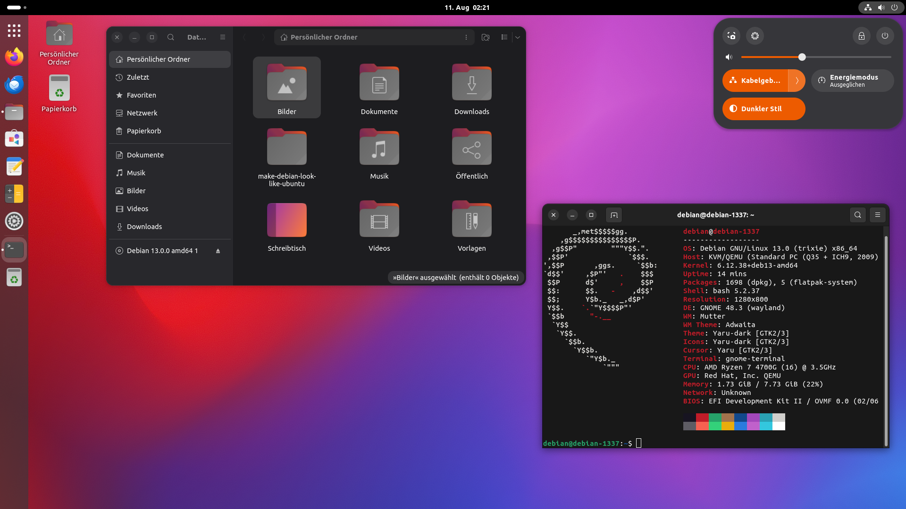

# make-debian-look-like-ubuntu

Origin: https://git.la10cy.net/DeltaLima/make-debian-look-like-ubuntu

This script performs all necessary steps to make a Debian 13 (trixie) Gnome desktop look like an Ubuntu desktop.
For older debian releases, please check out the [tags](https://git.la10cy.net/DeltaLima/make-debian-look-like-ubuntu/tags).

It also installs flatpak with flathub.org repository enabled and Firefox from there.

The settings are only applied to the user which is executing this script. The user has to be in the `sudo` group. If not, the script will advise you how to do so.

**Important!** After the first run of setup.sh, you have to reboot and re-run the script. 
When the script runs the first time, it is normal that the terminal font looks ugly after it. It's normal after a reboot.

## Installation

Just execute setup.sh and show will start:

```bash
$ bash make-debian-look-like-ubuntu.sh
```

You can customize standard packages, which gets installed. Just add an entry to the array defined in `include/packages.inc.sh`


